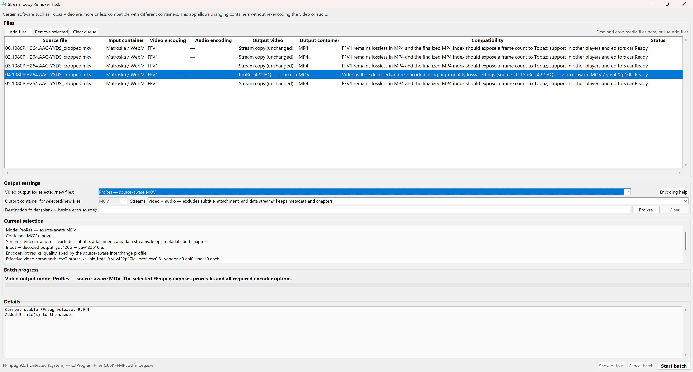
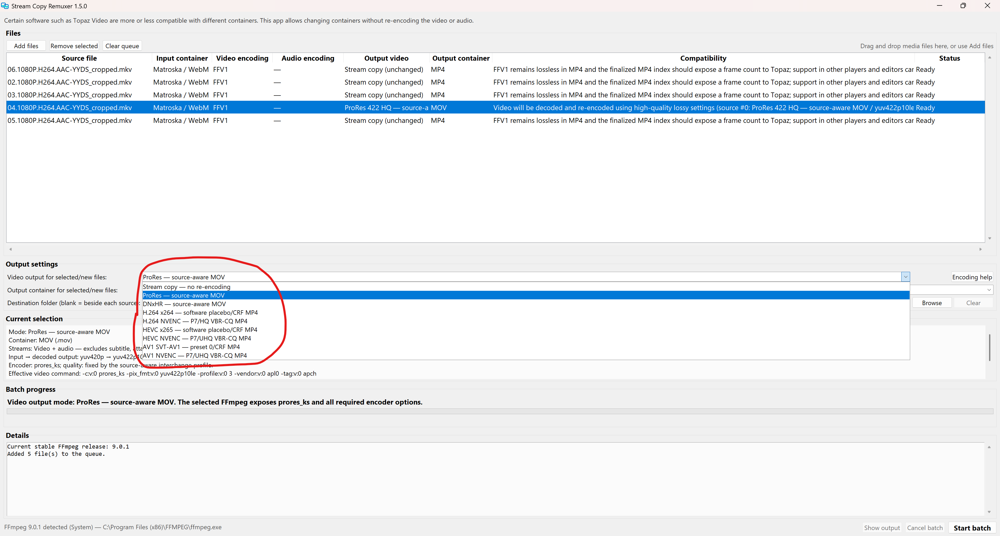

# Stream Copy Remuxer 1.6.1

Certain software such as Topaz Video are more or less compatible with different containers. Stream Copy Remuxer changes containers without re-encoding video or audio and also offers optional compatibility-focused video transcoding profiles.

## Download

[Download Stream Copy Remuxer.exe](https://github.com/skv89/Stream-Copy-Remuxer/raw/refs/tags/v1.6.1/Stream%20Copy%20Remuxer.exe)

[View the v1.6.1 release notes](https://github.com/skv89/Stream-Copy-Remuxer/releases/tag/v1.6.1)

Only compiled portable application artifacts are distributed. Application source, tests, requirements, build scripts, and internal development records are not published.

The executable keeps the stable filename `Stream Copy Remuxer.exe` across releases so existing shortcuts continue to work. The primary download is stored directly in the source-free release tag to preserve that exact filename.

SHA-256: `D527483970AF08A83728FA26C88384B793CE78D59FFE939E13211CA7C78B24AE`

## What's new in 1.6.1

- Fixes a false FFV1 preflight failure for variable- or irregular-frame-rate sources when a short preflight sample has a different whole-file average frame rate.
- Full output verification still validates the complete output cadence and timeline after encoding.
- Retains source-aware FFV1 version 3 output with exact options `-level 3 -coder 2 -context 1 -g 1 -slicecrc 1 -slices 16`.
- Retains MKV as the default FFV1 container, with MOV, MP4, and AVI also selectable.
- Preserves decoded bit depth, chroma, and alpha when supported, while retaining all existing stream-copy and transcoding modes.

## Screenshots

### Batch queue and source-aware ProRes selection

  

### Video output choices

  

> These screenshots are permanent project documentation. Keep both files in the public GitHub repository across future updates unless the repository owner explicitly requests their deletion.

## Portable application

Download and run `Stream Copy Remuxer.exe`. FFmpeg is detected from the system or can be installed into the application's own folder when needed. The executable is not Authenticode-signed.
